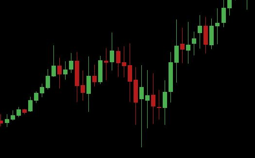

# TestingTechnicalAnalysis

## Project Overview
This repository contains the code and methodology for testing the predictive power of technical trading rules under different market regimes. The project aligns with the research study:

Research Question: Do technical trading rules generate risk-adjusted excess returns across volatility and macroeconomic regimes, or are they statistically indistinguishable from random noise once non-stationarity and autocorrelation are controlled?

The project focuses on evaluating whether technical indicators retain predictive value under varying market conditions using walkforward backtesting and rigorous statistical controls.

## Features
Cross-market analysis: Test strategies on multiple asset classes or indices.

Regime classification: Segment the market based on volatility, macroeconomic indicators, or other regimes.

Technical rule testing: Apply rules such as moving averages, RSI, MACD, and Bollinger Bands.

Walkforward backtesting: Simulate out-of-sample performance over time to avoid lookahead bias.

Risk-adjusted performance evaluation: Compute Sharpe ratio, CAGR, drawdowns, and other risk-adjusted metrics.

Causality and statistical robustness checks: Account for autocorrelation, non-stationarity, and random noise.

## Methodology
1. Data Retrieval
2. Strategy Implementation
3. Walkforward Backtesting
   - Split data into sequential training and testing windows.
   - Re-estimate model parameters in each training window and test out-of-sample.
4. Regime Segmentation
   - Define market regimes (e.g., high vs. low volatility, economic expansions vs. contractions).
   - Evaluate strategy performance within each regime to detect regime-dependent predictive power.
5. Performance Evaluation
   Compute risk-adjusted metrics:
   - Sharpe Ratio.
   - CAGR.
   - Maximum Drawdown.
   Conduct statistical robustness tests:
   - Autocorrelation adjustment.
   - Stationarity tests.
   - Randomization tests.

## Notes
- Strategies are tested across multiple regimes to evaluate predictive power under different market conditions.

- Backtesting assumes no transaction costs by default; they can be added for realism.

- Statistical controls ensure results are robust against random noise and market non-stationarity.
